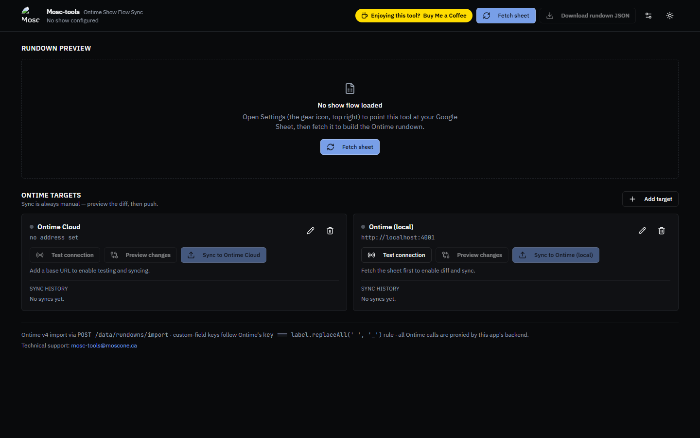

<div align="center">


# Ontime Show Flow Sync

**Your show flow lives in a Google Sheet. Your timers live in Ontime. Keep them in sync — without ever opening Ontime's settings.**

[](https://raw.githubusercontent.com/professorpete/mosc-tools-ontime-sync/windows-download/MoscToolsOntimeSync.exe)
&nbsp;
[](https://buymeacoffee.com/mosctools)

</div>

---

Every event producer knows the dance: the client keeps changing the run of show in a
nice, shareable Google Sheet — and someone has to retype every change into
[Ontime](https://www.getontime.no/) before doors. Cue numbers shift, durations change,
a video gets cut at rehearsal, and now your rundown and your sheet disagree ten minutes
before the show starts.

**Ontime Show Flow Sync ends the retyping.** Keep building your show flow in the
spreadsheet your clients already understand — colours, cue numbers, linked starts,
custom columns for audio, lighting, and stage — and push it to *all* of your Ontime
instances in one click. Cloud rundown for the remote team, local instance at front of
house: fetch the sheet, preview exactly what will change, sync. Done.

No digging through Ontime's settings. No CSV exports. No "wait, which version is
loaded?"

<div align="center">

</div>

## Why you'll like it

- **One source of truth.** The client-friendly Google Sheet *is* the show flow. Ontime
  always matches it.
- **All your instances at once.** Add as many sync targets as you like — Ontime Cloud
  and local machines (`http://192.168.x.x:4001`) side by side, each with its own sync
  history.
- **See the diff before you commit.** Every sync shows exactly what will be added,
  changed, or removed. Sync is always manual — nothing moves without your say-so.
- **Full show-flow fidelity.** Cue numbers, start/duration/end times, linked starts,
  item colours, and timer types come through. Extra sheet columns become Ontime custom
  fields automatically, and a `Notes` column fills Ontime's note field.
- **Aux timer automations from the sheet.** Add an `Aux Timer` column and put a
  duration (e.g. `01:00:00`) on any cue — or `none` to leave the timer alone. Each
  duration becomes an Ontime automation: when that cue starts, Aux timer 1 stops,
  resets to the new duration, and starts counting down. An explicit `00:00:00`
  **clears** the timer instead: it stops and zeroes out on that cue, so aux displays
  show nothing until the next reset row. One extra automation stops
  the aux timer when you stop playback at the end of the show. Automations are pushed
  with every sync: entries this tool created earlier (titles starting
  with `Mosc-sync aux:`) are replaced, while automations you built by hand in Ontime
  — and your OSC input settings — are never touched. The downloadable project JSON
  includes the same automations for manual imports.

  > Note: keep Aux timer 1's direction set to *count down* in Ontime (the default) —
  > automations can set and start the timer but cannot change its direction. The
  > `Timer Type` column is now optional: without it, blue rows count down and all
  > other rows get no timer, which is the house convention anyway.
- **Banner rows and frozen rows are fine.** Sheets are fetched with the raw CSV export
  (by tab id), so a title row above the header — like `ONTIME Rundown:` — or several
  frozen rows won't confuse the reader: it scans down the sheet for the real header row
  and simply notes the banner rows it skipped.
- **Runs on your machine, like Companion.** Download one file, double-click, and it
  opens in your browser. Because it runs locally, it reaches venue-network Ontime
  instances no hosted tool ever could — and a stage manager's tablet can use it via
  your LAN.

## Download & run (Windows)

1. Download [`MoscToolsOntimeSync.exe`](https://raw.githubusercontent.com/professorpete/mosc-tools-ontime-sync/windows-download/MoscToolsOntimeSync.exe)
   (44 MB) — also linked from the
   [latest release](https://github.com/professorpete/mosc-tools-ontime-sync/releases/latest).
2. Double-click it. A console window opens briefly, your browser opens to
   `http://localhost:5000` automatically, and the console window then minimizes itself
   to the taskbar out of your way.
   - Windows SmartScreen may warn about an unsigned app — choose "More info" → "Run anyway".
   - **Don't close the console window** — that kills the server instantly. It's meant to
     stay minimized in your taskbar; if you need to quit, restore it and press `Ctrl+C`.
3. Click the gear icon (top right), paste your Google Sheet ID and tab name, and fetch.

Your settings and sync history are saved in `%APPDATA%\MoscTools\OntimeSync\data.json` and
automatically reload the next time you launch the app — no need to re-enter your sheet ID
or sync targets. (The Windows build always reuses the same local profile, so this works
regardless of which browser it opens.) Other devices on your network can open the
console-printed LAN URL to use the same instance.

Starting over? Open the gear icon → "Clear all settings" to wipe the sheet source, sync
targets, and history back to defaults.

- Set `PORT=xxxx` before launching to use a different port.
- Set `NO_OPEN=1` to skip the automatic browser launch (also leaves the console window
  un-minimized, useful when running as a background/headless service).

An Excel template for the expected sheet layout is available in-app
(`/showflow-template.xlsx`). It includes the optional `Aux Timer` column (with sample
reset rows) alongside the classic `Timer Type` column (`none` / `count-down` for the
primary timer) — hover any header cell for that column's rules. Regenerate it with
`python3 script/generate-template.py`. The sheet just needs to be viewable by link
(or published to the web).

## Run from source (macOS / Linux / Windows)

Requires Node 20+.

```bash
git clone https://github.com/professorpete/mosc-tools-ontime-sync.git
cd mosc-tools-ontime-sync
npm start          # the app is prebuilt in dist/ — this just runs it
```

Then open <http://localhost:5000>.

To hack on it: `npm install`, then `npm run dev` (dev server) and `npm run build:full`
(rebuild `dist/`). `npm run build:exe` packages the Windows executable into `release/`
(requires the prebuilt `dist/`).

## Hosting it on a server (optional)

The app also runs fine as a hosted multi-user web app — every browser session gets its own
isolated settings, targets, and history, expiring after 30 idle days (`SESSION_TTL_DAYS` to
change). See [`deploy/DEPLOY.md`](deploy/DEPLOY.md). The one caveat: a hosted copy cannot reach
`192.168.x.x` addresses — that's exactly why the desktop build exists.

## Storage

Plain JSON (`data.json`) — no database server, no native modules.

| Mode | Location |
| --- | --- |
| Windows executable | `%APPDATA%\MoscTools\OntimeSync\data.json` |
| From source / hosted | `./data.json` (override dir with `SHOWFLOW_DATA=/path`) |

## Support this tool

If this saves you a pre-show panic, consider
[buying me a coffee ☕](https://buymeacoffee.com/mosctools).

Questions or ideas: [mosc-tools@moscone.ca](mailto:mosc-tools@moscone.ca)

MIT licensed.
